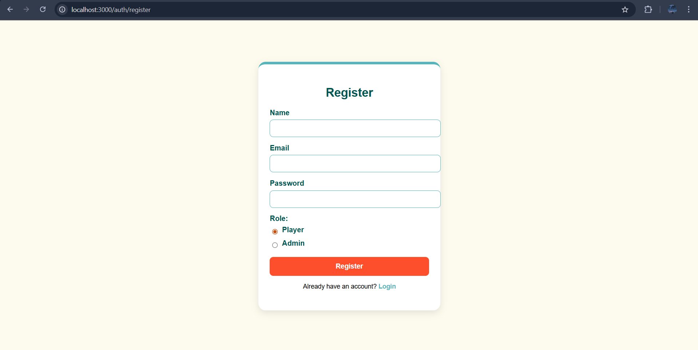

Sport Scheduler Web Application
Sport Scheduler is a full-stack web application built with Node.js, Express, and MongoDB. It's designed to help communities organize and participate in sports activities seamlessly. The application serves two main types of users: Admins, who manage the available sports, and Players, who create, join, and manage game sessions.

This project was developed as a capstone, demonstrating key web development concepts including user authentication, database management, MVC architecture, and dynamic front-end rendering with EJS.

🚀 Live Application
You can try out the live version of the Sport Scheduler here:

https://sports-scheduler-15uq.onrender.com 

✨ Core Features
Dual User Roles: A secure authentication system that differentiates between Admins and Players, providing each with a unique dashboard and capabilities.

Admin Sport Management: A dedicated admin panel to create and manage the list of available sports for sessions.

Session Creation & Management: Any logged-in user can create a new game session, specifying the sport, venue, date, time, and number of players needed.

Interactive Session Joining: Players can browse all active sessions on their dashboard and join any game with open slots. The UI intelligently prevents joining full or already-joined sessions.

Session Cancellation: Session creators can cancel their events, providing a reason that is displayed to all other users.

Admin Reporting: A powerful admin-only reports page that provides key statistics, including total sessions created and a breakdown of sport popularity.

📸 Screenshots
Here’s a sneak peek into the application's user interface.

🎬 Video Demonstration
Want to see the app in action? Watch this short video walkthrough that demonstrates the core features, from signing up as a player to managing sports as an admin.

https://youtu.be/Oe-LR4K3Xcw

🛠️ Technology Stack
Backend: Node.js, Express.js

Database: MongoDB with Mongoose ODM

Templating Engine: EJS (Embedded JavaScript)

Authentication: Custom Session-based Auth using express-session and bcryptjs

Session Store: connect-mongo
